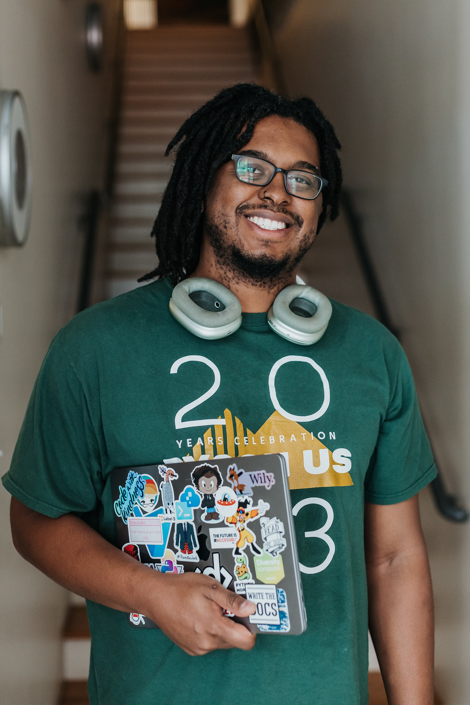

## Mariatta

{: width="300" align=left}

Mariatta is a Python Core Developer.
She co-hosts the podcast series PyPodcats: Hidden Figures of Python,
highlighting the voices of underrepresented group members in the Python community.
She is the author of PEP 581 for migrating CPython's issue tracker to GitHub,
a change that significantly improved the experience for contributing to CPython.
She is currently a member of Python Docs Editorial Board.
As a serial conference organizer, she has chaired various Python community conferences,
including PyCascades, PyCon US, and PyLadiesCon.
For her contributions to the Python community,
she received the PSF Community Service Award and is a PSF Fellow member.
You might also know her from the internet hashtags #IceCreamSelfie and #TypoOfTheDay

 

## Jay Miller

{: width="300" align=left}

Jay is a Staff Developer Advocate at Aiven.
Jay is also the founder of Black Python Devs
where they work to extend the reach of Python communities, projects, and organizations
to Black developers around the globe.
Jay has served as a keynote speaker in the Python Community
and when away from the keyboard can often be found cheering on their favorite baseball team.

 
